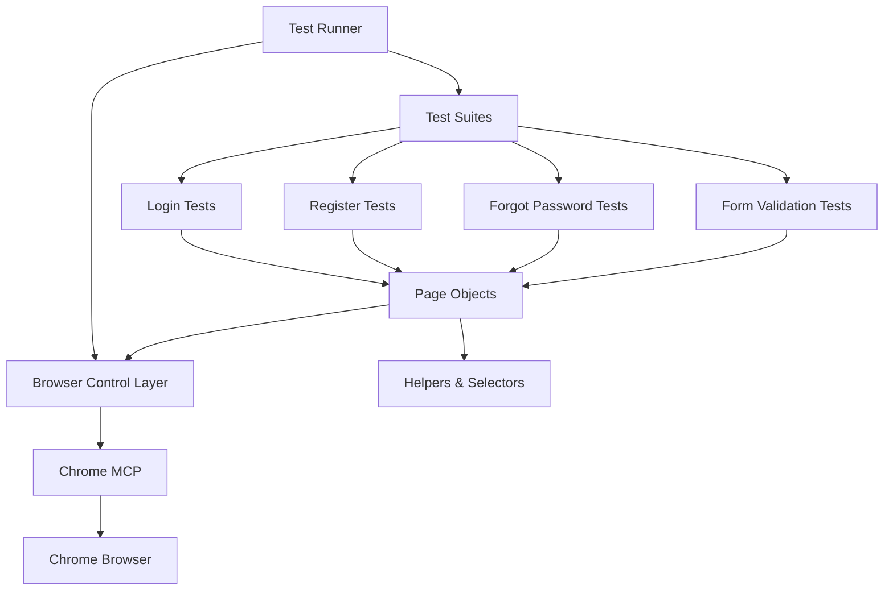

# Design Document

## Overview

本设计文档定义了使用 Chrome MCP 进行用户认证功能端到端（E2E）测试的技术实现方案。通过 Chrome MCP 的浏览器自动化能力，在真实的 Chrome 浏览器环境中模拟用户操作，验证登录、注册、密码重置等核心功能的完整流程，确保系统的稳定性和用户体验质量。

### 技术栈
- **Chrome MCP**: 浏览器自动化工具，提供页面导航、元素查找、交互操作等能力
- **TypeScript**: 类型安全的测试脚本编写
- **Node.js**: 测试运行环境
- **测试框架**: 自定义测试运行器，支持测试组织、执行和报告

## Steering Document Alignment

### Technical Standards (tech.md)

本设计遵循以下技术标准：

1. **TypeScript 优先**: 所有测试代码使用 TypeScript 编写，确保类型安全
2. **模块化设计**: 测试代码按功能模块组织，每个模块独立可测
3. **错误处理**: 完善的错误捕获和处理机制，确保测试失败时提供清晰的诊断信息
4. **代码复用**: 提取通用操作为辅助函数，避免代码重复

### Project Structure (structure.md)

测试文件将按照以下结构组织：

```
tests/
├── e2e/
│   ├── auth/
│   │   ├── helpers/          # 辅助函数和页面对象
│   │   │   ├── browser.ts    # Chrome MCP 封装
│   │   │   ├── selectors.ts  # 元素选择器
│   │   │   └── test-data.ts  # 测试数据
│   │   ├── login.spec.ts     # 登录功能测试
│   │   ├── register.spec.ts  # 注册功能测试
│   │   ├── forgot-password.spec.ts  # 密码重置测试
│   │   └── form-validation.spec.ts  # 表单验证测试
│   ├── runner.ts             # 测试运行器
│   └── reporter.ts           # 测试报告生成器
└── fixtures/                 # 测试夹具和配置
    └── auth-config.ts        # 认证测试配置
```

## Code Reuse Analysis

### Existing Components to Leverage

1. **认证视图组件** (`src/features/auth/views/`)
   - **LoginView.vue**: 登录页面组件，包含邮箱、密码输入框和登录按钮
   - **RegisterView.vue**: 注册页面组件，包含邮箱、密码、确认密码和服务条款
   - **ForgotPasswordView.vue**: 忘记密码页面，包含邮箱输入和成功状态
   - **用途**: E2E 测试将直接与这些渲染的组件交互

2. **验证器工具** (`src/features/auth/utils/validators.ts`)
   - **email()**: 邮箱格式验证
   - **密码长度验证**: 至少 8 个字符
   - **用途**: 测试中将使用相同的验证规则验证前端表单行为

3. **路由配置** (`src/router`)
   - **/auth/login**: 登录页面路由
   - **/auth/register**: 注册页面路由
   - **/auth/forgot-password**: 忘记密码页面路由
   - **用途**: 测试导航和页面跳转

4. **Supabase 配置** (`.env`)
   - **测试环境 Supabase URL**: 用于测试环境的认证服务
   - **测试环境 Supabase Anon Key**: 测试用的匿名密钥
   - **用途**: 测试将使用测试环境的 Supabase 实例，避免影响生产数据

### Integration Points

1. **前端应用**: `http://localhost:5173` (开发服务器)
   - E2E 测试将启动或连接到正在运行的开发服务器
   - 通过浏览器访问前端页面进行测试

2. **Supabase Auth**: 测试环境的认证后端
   - 创建测试账号进行注册测试
   - 验证登录功能
   - 测试密码重置流程
   - 测试完成后清理测试数据

## Architecture

### 整体架构

E2E 测试采用分层架构设计：

1. **测试运行器层** (Test Runner)
   - 负责测试的发现、执行和结果收集
   - 提供测试生命周期钩子（beforeAll, afterAll, beforeEach, afterEach）
   - 生成测试报告

2. **浏览器控制层** (Browser Control)
   - 封装 Chrome MCP API
   - 提供页面导航、元素查找、交互操作的抽象接口
   - 管理浏览器实例和会话

3. **页面对象层** (Page Objects)
   - 将每个页面封装为对象，提供语义化的操作方法
   - 隐藏实现细节，提高测试可维护性
   - LoginPage, RegisterPage, ForgotPasswordPage

4. **测试用例层** (Test Cases)
   - 具体的测试场景
   - 使用页面对象和辅助函数编写测试逻辑
   - 验证业务需求和验收标准

### Modular Design Principles

- **Single File Responsibility**: 每个测试文件专注于一个功能模块（登录、注册、密码重置）
- **Component Isolation**: 每个页面对象独立封装，不依赖其他页面
- **Service Layer Separation**: 测试逻辑与浏览器控制分离，便于替换实现
- **Utility Modularity**: 辅助函数按功能拆分（导航、表单填写、断言）



## Components and Interfaces

### 1. Browser Helper (`browser.ts`)

**Purpose**: 封装 Chrome MCP API，提供简化的浏览器操作接口

**Interfaces**:
```typescript
interface BrowserHelper {
  // 页面导航
  navigateTo(url: string): Promise<void>
  waitForPageLoad(): Promise<void>

  // 元素查找
  findElement(selector: string): Promise<ElementHandle>
  findElements(selector: string): Promise<ElementHandle[]>

  // 交互操作
  click(selector: string): Promise<void>
  fillInput(selector: string, value: string): Promise<void>
  checkCheckbox(selector: string): Promise<void>

  // 等待和断言
  waitForElement(selector: string, timeout?: number): Promise<ElementHandle>
  waitForText(selector: string, text: string): Promise<void>
  isVisible(selector: string): Promise<boolean>
  getText(selector: string): Promise<string>
  getAttribute(selector: string, attribute: string): Promise<string>

  // 浏览器控制
  screenshot(path: string): Promise<void>
  close(): Promise<void>
}
```

**Dependencies**:
- Chrome MCP 工具集

**Reuses**:
- 无（底层封装）

### 2. Selectors (`selectors.ts`)

**Purpose**: 集中管理所有测试选择器，便于维护

**Interfaces**:
```typescript
interface AuthSelectors {
  // 通用选择器
  emailInput: string
  passwordInput: string
  submitButton: string
  errorMessage: string
  loadingIndicator: string

  // 注册页面
  confirmPasswordInput: string
  agreeTermsCheckbox: string

  // 忘记密码页面
  resendButton: string
  returnToLoginButton: string
  successMessage: string
}

const authSelectors: AuthSelectors = {
  emailInput: '#email',
  passwordInput: '#password',
  submitButton: 'button[type="submit"]',
  errorMessage: '[data-testid="auth-error"]',
  loadingIndicator: '[data-testid="loading"]',
  confirmPasswordInput: '#confirmPassword',
  agreeTermsCheckbox: '#agree-terms',
  resendButton: 'button:has-text("重新发送")',
  returnToLoginButton: 'button:has-text("返回登录")',
  successMessage: '[data-testid="success-message"]'
}
```

**Dependencies**:
- 无

**Reuses**:
- 与前端组件的 data-testid 属性对应

### 3. Page Objects

**3.1 LoginPage**

**Purpose**: 封装登录页面的所有操作和状态查询

**Interfaces**:
```typescript
class LoginPage {
  // 导航到登录页
  visit(): Promise<void>

  // 填写登录表单
  fillEmail(email: string): Promise<void>
  fillPassword(password: string): Promise<void>

  // 提交表单
  submit(): Promise<void>

  // 状态查询
  getErrorMessage(): Promise<string>
  isLoading(): Promise<boolean>
  isRedirected(): Promise<boolean>

  // 完整操作流程
  login(email: string, password: string): Promise<void>
}
```

**Dependencies**:
- BrowserHelper
- authSelectors

**Reuses**:
- 使用统一的浏览器控制接口
- 使用集中的选择器定义

**3.2 RegisterPage**

**Purpose**: 封装注册页面的所有操作和状态查询

**Interfaces**:
```typescript
class RegisterPage {
  visit(): Promise<void>

  fillEmail(email: string): Promise<void>
  fillPassword(password: string): Promise<void>
  fillConfirmPassword(password: string): Promise<void>
  agreeTerms(agree: boolean): Promise<void>

  submit(): Promise<void>

  getErrorMessage(): Promise<string>
  getFieldError(fieldName: 'email' | 'password' | 'confirmPassword'): Promise<string>
  isLoading(): Promise<boolean>
  isRedirectedToLogin(): Promise<boolean>

  register(email: string, password: string): Promise<void>
}
```

**Dependencies**:
- BrowserHelper
- authSelectors

**Reuses**:
- BrowserHelper 基础接口

**3.3 ForgotPasswordPage**

**Purpose**: 封装忘记密码页面的所有操作和状态查询

**Interfaces**:
```typescript
class ForgotPasswordPage {
  visit(): Promise<void>

  fillEmail(email: string): Promise<void>
  submit(): Promise<void>

  getErrorMessage(): Promise<string>
  getSuccessMessage(): Promise<string>
  isLoading(): Promise<boolean>
  isSuccessState(): Promise<boolean>

  returnToLogin(): Promise<void>
  resend(): Promise<void>
}
```

**Dependencies**:
- BrowserHelper
- authSelectors

**Reuses**:
- BrowserHelper 基础接口

### 4. Test Data Manager (`test-data.ts`)

**Purpose**: 管理测试数据，生成唯一的测试用户凭据

**Interfaces**:
```typescript
interface TestData {
  validEmail: string
  invalidEmail: string
  validPassword: string
  shortPassword: string
  weakPassword: string
}

class TestDataManager {
  // 生成唯一的测试邮箱
  generateUniqueEmail(): string

  // 预定义测试数据
  get testData(): TestData

  // 清理测试数据（删除测试账号）
  async cleanupTestUser(email: string): Promise<void>
}
```

**Dependencies**:
- Supabase 客户端（用于清理测试数据）

**Reuses**:
- Supabase admin API 用于测试数据清理

### 5. Test Runner (`runner.ts`)

**Purpose**: 测试运行器，负责测试的发现、执行和报告

**Interfaces**:
```typescript
interface TestSuite {
  name: string
  tests: TestCase[]
  beforeAll?: () => Promise<void>
  afterAll?: () => Promise<void>
  beforeEach?: () => Promise<void>
  afterEach?: () => Promise<void>
}

interface TestCase {
  name: string
  fn: () => Promise<void>
  timeout?: number
}

class TestRunner {
  // 注册测试套件
  registerSuite(suite: TestSuite): void

  // 运行所有测试
  run(): Promise<TestResults>

  // 运行特定测试套件
  runSuite(suiteName: string): Promise<TestResults>
}

interface TestResults {
  total: number
  passed: number
  failed: number
  duration: number
  failures: TestFailure[]
}

interface TestFailure {
  testName: string
  error: Error
  screenshot?: string
}
```

**Dependencies**:
- BrowserHelper（用于全局浏览器管理）
- Reporter（用于生成报告）

**Reuses**:
- 无（核心运行器）

### 6. Reporter (`reporter.ts`)

**Purpose**: 生成测试报告，提供清晰的测试结果展示

**Interfaces**:
```typescript
class TestReporter {
  // 报告测试开始
  onTestStart(testName: string): void

  // 报告测试通过
  onTestPass(testName: string, duration: number): void

  // 报告测试失败
  onTestFail(testName: string, error: Error, screenshot?: string): void

  // 生成最终报告
  generateReport(results: TestResults): Promise<void>
}
```

**Dependencies**:
- 文件系统（用于保存报告和截图）

**Reuses**:
- 无

## Data Models

### Test Result Model

```typescript
interface TestResult {
  id: string
  suiteName: string
  testName: string
  status: 'passed' | 'failed' | 'skipped'
  duration: number
  error?: Error
  screenshot?: string
  timestamp: Date
}

interface TestSuiteResult {
  suiteName: string
  tests: TestResult[]
  summary: {
    total: number
    passed: number
    failed: number
    duration: number
  }
}
```

### Test User Model

```typescript
interface TestUser {
  email: string
  password: string
  createdAt: Date
  shouldCleanup: boolean
}
```

### Test Configuration Model

```typescript
interface TestConfig {
  baseUrl: string
  supabaseUrl: string
  supabaseAnonKey: string
  supabaseServiceKey: string
  timeout: number
  screenshotOnFailure: boolean
  cleanupTestData: boolean
}
```

## Error Handling

### Error Scenarios

1. **页面加载超时**
   - **场景**: 导航到页面后在指定时间内页面未完成加载
   - **处理**: 等待最长 10 秒，超时后记录错误并截图，标记测试失败
   - **用户影响**: 测试失败，错误日志包含超时信息和截图

2. **元素未找到**
   - **场景**: 查找的 DOM 元素在页面中不存在
   - **处理**: 等待元素出现（最长 5 秒），超时后记录错误和当前页面 URL
   - **用户影响**: 测试失败，错误信息包含缺失元素的选择器

3. **交互失败**
   - **场景**: 点击、填写表单等操作失败（元素被遮挡、不可见等）
   - **处理**: 捕获异常，记录错误和截图，尝试滚动到元素可见区域后重试一次
   - **用户影响**: 测试失败，错误信息包含原始错误和重试状态

4. **断言失败**
   - **场景**: 实际结果与预期结果不符
   - **处理**: 记录详细的断言失败信息（期望值 vs 实际值），截图
   - **用户影响**: 测试失败，错误信息清晰显示差异

5. **网络错误**
   - **场景**: API 请求失败（网络超时、服务器错误等）
   - **处理**: 记录网络错误详情，检查页面是否显示正确的错误提示
   - **用户影响**: 测试可能失败（取决于预期的错误处理行为）

6. **测试数据冲突**
   - **场景**: 尝试注册已存在的邮箱
   - **处理**: 每次测试生成唯一的邮箱地址（使用时间戳和随机数）
   - **用户影响**: 不应发生（通过唯一邮箱生成避免）

### 错误报告格式

```typescript
interface TestError {
  message: string
  selector?: string
  url?: string
  screenshot?: string
  stackTrace?: string
  timestamp: Date
}
```

## Testing Strategy

### E2E 测试组织

测试按功能模块组织成独立的测试套件：

1. **Login Test Suite** (`login.spec.ts`)
   - 测试登录页面的所有验收标准
   - 包含 5-7 个测试用例

2. **Register Test Suite** (`register.spec.ts`)
   - 测试注册流程的所有验收标准
   - 包含 6-8 个测试用例

3. **Forgot Password Test Suite** (`forgot-password.spec.ts`)
   - 测试密码重置流程
   - 包含 4-5 个测试用例

4. **Form Validation Test Suite** (`form-validation.spec.ts`)
   - 测试所有表单验证规则
   - 包含 5-6 个测试用例

### 测试执行流程

1. **前置条件**
   - 启动开发服务器（`pnpm dev`）
   - 确保 Supabase 测试环境可用
   - 初始化 Chrome MCP 浏览器实例

2. **测试执行**
   - 按测试套件顺序执行
   - 每个测试独立运行，不依赖其他测试的状态
   - 测试失败时截图并继续执行下一个测试

3. **后置清理**
   - 清理测试数据（删除测试账号）
   - 关闭浏览器实例
   - 生成测试报告

### 测试覆盖率

- **功能覆盖**: 所有需求文档中定义的验收标准
- **场景覆盖**: 正常流程、错误流程、边界情况
- **页面覆盖**: 登录页、注册页、忘记密码页

### 测试隔离

- 每个测试用例独立运行
- 使用唯一的测试数据（邮箱、用户名）
- 测试之间不共享状态
- 失败的测试不影响其他测试的执行

### 性能要求

- 单个测试用例执行时间 < 30 秒
- 完整测试套件执行时间 < 5 分钟
- 页面加载等待时间最长 10 秒
- 元素查找等待时间最长 5 秒

### 重试机制

对于偶发性失败（如网络延迟、页面加载慢），支持测试重试：
- 失败后自动重试 1 次
- 重试前等待 2 秒
- 两次都失败才标记为测试失败

## Security Considerations

### 测试环境隔离

- 使用独立的 Supabase 测试项目
- 测试环境 Supabase URL 和密钥存储在 `.env.test` 文件
- 测试代码绝不使用生产环境凭据

### 测试数据管理

- 测试账号密码符合安全要求（至少 8 个字符）
- 测试完成后清理测试数据
- 不使用真实用户数据进行测试

### 敏感信息保护

- `.env.test` 文件不提交到版本控制
- 测试报告中不包含敏感信息（密码、令牌等）
- 截图中避免包含敏感数据（必要时打码）

## Implementation Notes

### Chrome MCP 集成

由于 Chrome MCP 可能提供特定的工具集，实际的浏览器控制实现将根据可用的 MCP 工具进行调整。设计中的 `BrowserHelper` 接口将作为抽象层，便于适配 Chrome MCP 的具体 API。

### 测试运行器选择

根据项目需求和 Chrome MCP 的特性，可能采用以下方案之一：
1. **自定义测试运行器**: 完全自主实现，轻量级
2. **集成现有框架**: 如 Playwright、Puppeteer（如果 Chrome MCP 支持与之互操作）
3. **混合方案**: 使用现有框架的断言库，自定义 Chrome MCP 集成

### 预期的 Chrome MCP 工具

基于 MCP 标准和 Chrome 自动化需求，预期 Chrome MCP 将提供以下工具：
- 页面导航和加载
- 元素查找和选择
- 点击、输入、滚动等交互
- 元素状态查询（可见性、文本内容、属性）
- 截图和 PDF 生成
- JavaScript 执行
- 网络请求拦截和 mock（可选）

实际的工具集将在实现阶段根据 Chrome MCP 的可用工具进行调整。
