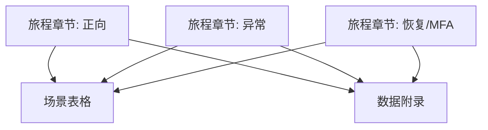

# 设计文档

## 概述

该规格旨在构建一套覆盖认证模块的手工测试体系，输出结构化脚本、执行顺序与数据前置条件，确保 QA 团队在桌面/移动/Web API 等入口都能复现登录、异常凭证、恢复/MFA 的关键场景。**最终交付是一个 JSON 列表**，其中每个对象代表一条手工测试用例，包含前置条件、操作步骤、预期结果等字段；整个过程中不提供或修改应用代码，仅聚焦测试描述。设计重点是把测试步骤拆分为模块化章节（正向、负向、恢复），并定义记录模版、工单同步方式以及对外依赖（邮件、日志、身份服务沙箱）。

## 与指导性文档的对齐

### 技术标准 (tech.md)

- 延续项目既有的“可审计、安全优先”标准：所有测试脚本需记录输入、输出及日志路径。
- 沿用现有 QA 工具链（Playwright + Postman + 移动真机农场），避免额外栈。
- 明确 TLS、速率限制、审计日志等安全控制点的验收方法。

### 项目结构 (structure.md)

- 测试说明将归档在 `docs/testing/auth-manual/` 子目录，按旅程拆分 Markdown 与数据集。
- 复用 `docs/testing/_shared-fixtures.md` 中的账号、设备、环境变量说明，保持一致的命名与权限层级。

## 代码复用分析

### 可复用组件

- **`docs/testing/_shared-fixtures.md`**：引用已有的测试账号、邮件捕获与日志配置说明。
- **`src/auth/session` 相关文档**：链接到现有的会话管理逻辑，帮助测试人员理解期望行为。

### 集成点

- **身份服务 API**：需要列出手工触发 REST 调用的 cURL/Insomnia 示例。
- **邮件服务 (Mailhog/企业邮件沙箱)**：在恢复与 MFA 场景中取得验证码。
- **审计日志/监控面板**：记录错误码与告警阈值验证步骤。

## 架构

文档结构遵循三层：

1. **旅程章节**：正向认证、异常凭证、恢复/MFA。
2. **场景表格/JSON 片段**：每章先以表格梳理，再生成 JSON 列表片段以供导入测试工具。
3. **数据与依赖附录**：集中说明账号、设备、第三方工具及日志入口。

### 模块化原则

- 单文件职责：每个 Markdown 仅关注一个旅程；公共依赖提炼到共享附件。
- 组件隔离：示例请求、界面截图、日志定位分别放置，避免混杂。
- 服务层分离：文档描述 UI、API、后台审计三个层面，测试执行时可独立选择入口。
- 实用工具模块化：将 Playwright 脚本片段、API 模板、SQL 校验语句存放到各自子文件夹。



## 组件与接口

### 文档组件 1：`docs/testing/auth-manual/happy-path.md`

- **目的**：描述登录/登出/会话保持的手工步骤。
- **接口**：提供 Web 前端、移动端、REST API 入口的操作序列。
- **依赖**：共享账号、稳定网络、默认权限 Dashboard。
- **复用**：引用共享 fixtures，链接现有 UI 截图。

### 文档组件 2：`docs/testing/auth-manual/negative-flows.md`

- **目的**：覆盖错误密码、禁用账号、HTTP 传输等负向场景。
- **接口**：列出表单输入、API 请求、预期日志。
- **依赖**：速率限制配置、审计系统、告警通道。
- **复用**：复用安全策略描述、告警阈值表。

### 文档组件 3：`docs/testing/auth-manual/recovery-mfa.md`

- **目的**：描述忘记密码、MFA 设备绑定、恢复码重置的流程。
- **接口**：邮件/短信、Authenticator 应用、后台管理入口。
- **依赖**：Mailhog、OTP 种子、后端审核工具。
- **复用**：引用邮件模板、MFA 注册 API。

## 数据模型

### 测试账号模型

```
TestAccount
- id: string (qa-happy-user, qa-locked-user, qa-mfa-user)
- email: string
- role: enum(User, Admin)
- state: enum(Active, Disabled, Locked)
- mfaConfigured: boolean
```

### 测试设备模型

```
TestDevice
- id: string (web-chrome, ios-safari, android-chrome)
- platform: enum(Web, iOS, Android)
- trustLevel: enum(Known, New)
- networkProfile: enum(Internal, External)
```

## JSON 测试用例格式

为满足“仅输出 JSON 列表”的要求，所有手工测试用例最终都将遵循以下结构示例：

```
{
  "id": "AUTH-HP-001",
  "title": "Web 端成功登录",
  "journey": "happy-path",
  "preconditions": [
    "qa-happy-user 账号处于 Active 状态",
    "使用 web-chrome 设备，并具备稳定网络"
  ],
  "steps": [
    "打开登录页",
    "输入有效邮箱与密码",
    "点击登录并等待重定向"
  ],
  "expectedResults": [
    "2 秒内跳转至 Dashboard",
    "浏览器存储新的会话 Cookie"
  ],
  "artifacts": {
    "screenshots": true,
    "logs": ["auth-service", "audit-log"],
    "notifications": ["email"]
  }
}
```

- `journey` 字段对应三个章节（happy-path、negative、recovery-mfa），方便过滤。
- `preconditions/steps/expectedResults` 均采用字符串数组，保持执行顺序并易于导入 QA 平台。
- `artifacts` 描述在执行用例时需要收集的证据（截图、日志、邮件等），确保可审计。
- 所有 JSON 对象组成列表后写入 `docs/testing/auth-manual/cases.json`，并在章节 Markdown 中引用对应 `id`。

## 错误处理

### 场景 1：速率限制触发

- **处理**：记录精确的错误码、时间戳、锁定时长，并截图提示信息。
- **用户影响**：登录界面展示冷却提示，后台产生告警。

### 场景 2：恢复码过期

- **处理**：在日志中确认旧码失效事件，并验证新邮件内容；记录清理命令。
- **用户影响**：界面提示“验证码过期”，并提供重新发送按钮。

## 测试策略

### 单元测试

- 不直接新增代码单测，但会引用现有自动化测试结果到文档中，提示需要先通过 CI。

### 集成测试

- 将 Playwright/后端 API 自动化脚本链接到对应手工场景，作为验证补充。
- 在负向场景中添加日志校验脚本（例如 `scripts/verify-rate-limit.ts`）。

### 端到端测试

- UI 层面：列出每次回归必跑的 happy-path 与异常场景。
- API 层面：提供 cURL/Insomnia 片段让测试人员快速复现。
- 移动端：在真机农场中记录截图及步骤编号，以便复查。
