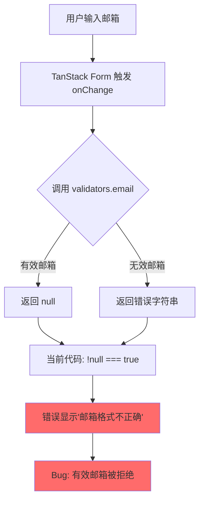
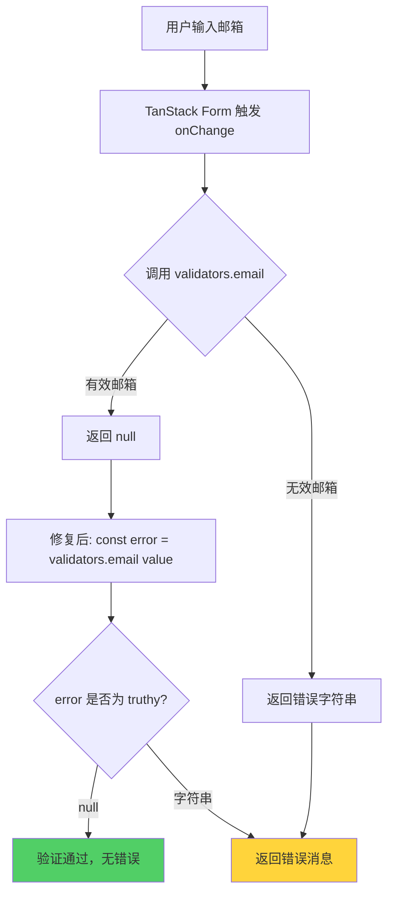

# Design Document

## Overview

本设计文档描述如何修复登录页邮箱验证功能的 bug。当前 bug 的根本原因是验证器返回值处理错误：`validators.email()` 返回 `string | null`（null 表示验证通过），但代码错误地使用了 `!validators.email(value)`，导致有效邮箱返回 true（因为 `!null === true`），从而触发错误提示。

修复方案非常简单直接：正确处理验证器的返回值类型，将逻辑从 `if (!validators.email(value))` 改为 `const error = validators.email(value); if (error) return error`。

## Steering Document Alignment

### Technical Standards (tech.md)

本项目遵循以下技术标准：

- **Vue 3 Composition API**: 使用 `<script setup>` 语法和响应式工具
- **TypeScript 类型安全**: 所有函数都有明确的类型签名
- **TanStack Form**: 使用声明式表单验证
- **模块化验证器**: 验证逻辑集中在 `validators.ts` 中

本修复完全符合现有技术标准，不引入新的依赖或模式。

### Project Structure (structure.md)

项目采用 features-based 结构：

```
src/features/auth/
├── components/      # UI 组件
├── hooks/          # 业务逻辑 hooks
├── utils/          # 工具函数（包括验证器）
└── views/          # 视图页面
```

修复仅涉及 `src/features/auth/views/LoginView.vue`，保持模块边界清晰。

## Code Reuse Analysis

### Existing Components to Leverage

- **validators.ts**: 验证器模块本身无需修改，API 设计（返回 `string | null`）是正确的
- **LoginView.vue**: 仅修复验证逻辑，保持组件结构不变
- **AuthForm.vue**: 表单容器组件，无需修改
- **Input.vue**: shadcn-vue 输入组件，无需修改

### Integration Points

- **TanStack Form**: 使用 `form.Field` 的 `validators` API
- **validators.email()**: 保持现有的 API 契约不变
- **错误显示逻辑**: 保持现有的 `field.state.meta.errors[0]` 显示机制

## Architecture

### Bug 根本原因分析



### 修复方案架构



### Modular Design Principles

- **Single File Responsibility**: `LoginView.vue` 负责视图层验证逻辑，`validators.ts` 负责核心验证规则
- **Component Isolation**: 修复不涉及其他组件
- **Service Layer Separation**: 保持服务层（authService）不变
- **Utility Modularity**: `validators.email()` 作为独立工具函数，API 保持不变

## Components and Interfaces

### LoginView.vue（修改）

- **Purpose:** 用户登录页面视图
- **修改内容:** 邮箱字段验证器的 `onChange` 回调逻辑
- **修改前:**
  ```typescript
  :validators="{
    onChange: ({ value }) => {
      if (!value) return '邮箱不能为空'
      if (!validators.email(value)) return '邮箱格式不正确'  // ❌ Bug
    },
  }"
  ```
- **修改后:**
  ```typescript
  :validators="{
    onChange: ({ value }) => {
      if (!value) return '邮箱不能为空'
      const emailError = validators.email(value)  // ✅ 正确
      if (emailError) return emailError
    },
  }"
  ```
- **Dependencies:**
  - `@tanstack/vue-form`: useForm
  - `@/features/auth/utils/validators`: validators.email
  - Vue Router: useRouter
- **Reuses:** 保持现有组件结构、hooks、表单字段

### validators.ts（无需修改）

- **Purpose:** 提供表单验证函数
- **API:**
  ```typescript
  function validateEmail(email: string): string | null
  // 返回 null 表示验证通过，返回字符串表示错误消息
  ```
- **Why No Change:** API 设计本身是正确的，返回 `string | null` 是合理的模式

## Data Models

无需新的数据模型。修复仅涉及验证逻辑，不改变数据流。

### 验证器返回值类型

```typescript
type ValidationResult = string | null
// null = 验证通过
// string = 错误消息
```

## Error Handling

### Error Scenarios

1. **空邮箱输入**
   - **Handling:** 返回 "邮箱不能为空"
   - **User Impact:** 显示红色错误提示在邮箱输入框下方

2. **无效邮箱格式**（如 test、test@、@example.com）
   - **Handling:** `validators.email()` 返回 "请输入有效的邮箱地址"
   - **User Impact:** 显示红色错误提示在邮箱输入框下方

3. **有效邮箱格式**（如 test@example.com）
   - **Handling:** `validators.email()` 返回 `null`，验证器返回 `undefined`（无错误）
   - **User Impact:** 不显示错误提示，用户可以继续填写或提交表单

4. **邮箱包含前后空格**（如 " test@example.com "）
   - **Handling:** `validators.email()` 内部自动 trim，验证实际邮箱内容
   - **User Impact:** 空格不影响验证结果

## Testing Strategy

### Unit Testing

**文件:** `src/features/auth/views/LoginView.spec.ts`（新建）

测试用例：
1. 有效邮箱不应显示错误（如 test@example.com）
2. 无效邮箱应显示错误（如 test、test@、@example.com）
3. 空邮箱应显示"邮箱不能为空"
4. 邮箱前后空格应被正确处理

**当前状态:** 项目已有 Vitest 配置和测试脚本

### Integration Testing

**测试流程:**
1. 启动开发服务器
2. 访问登录页 `/auth/login`
3. 输入有效邮箱（test@example.com）→ 应无错误提示
4. 输入无效邮箱（test）→ 应显示"请输入有效的邮箱地址"
5. 清空邮箱 → 应显示"邮箱不能为空"
6. 输入有效邮箱和有效密码 → 应能成功提交表单

### 手动验证步骤

1. 运行 `pnpm dev`
2. 打开浏览器访问 `http://localhost:5173/auth/login`
3. 测试各种邮箱输入：
   - `test@example.com` → ✅ 无错误
   - `test` → ❌ "请输入有效的邮箱地址"
   - `@example.com` → ❌ "请输入有效的邮箱地址"
   - `test@` → ❌ "请输入有效的邮箱地址"
   - ``（空）→ ❌ "邮箱不能为空"
   - ` test@example.com ` → ✅ 无错误（自动 trim）

## Implementation Notes

### 修改文件清单

1. **src/features/auth/views/LoginView.vue**
   - 第 80-85 行：邮箱字段验证器逻辑
   - 修改：将 `if (!validators.email(value))` 改为 `const emailError = validators.email(value); if (emailError)`

2. **新建测试文件（可选但推荐）**
   - `src/features/auth/views/LoginView.spec.ts`
   - 测试邮箱验证的各种场景

### 不需要修改的文件

- `src/features/auth/utils/validators.ts` - 验证器本身正确，无需修改
- `src/features/auth/views/RegisterView.vue` - 如有类似问题需要一并检查修复
- `src/features/auth/views/ForgotPasswordView.vue` - 如有类似问题需要一并检查修复

### 向后兼容性

✅ 完全向后兼容
- 不改变任何 API 契约
- 不改变 UI 结构
- 仅修复逻辑错误
- 不影响其他组件

### 性能影响

✅ 无性能影响
- 修复前后都是调用一次 `validators.email()`
- 不引入额外的计算或重渲染
