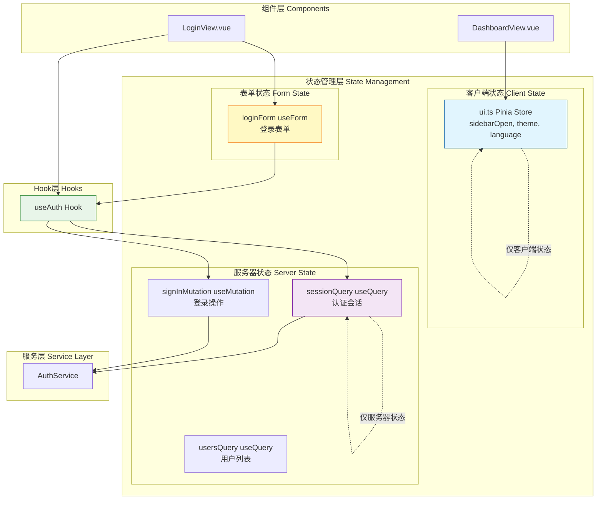
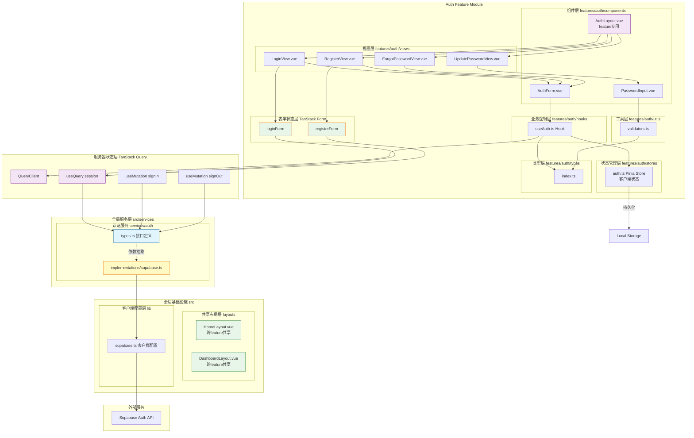
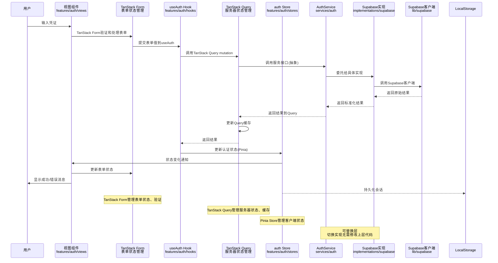

# 设计文档

## 概述

本设计文档描述了基于Supabase的用户认证系统的完整技术实现。系统采用模块化架构，使用Vue 3 Composition API、Pinia状态管理和shadcn-vue组件库，提供可扩展、可维护的认证解决方案。

该系统实现了三个核心功能：
- 用户注册（邮箱+密码）
- 用户登录（邮箱+密码）
- 密码重置（邮件重置流程）

## 与项目标准对齐

### 技术标准

本设计遵循以下技术标准和最佳实践：

- **Vue 3 Composition API**: 使用 `<script setup>` 语法，提供更好的类型推断和代码组织
- **TypeScript严格模式**: 所有组件和composables都使用TypeScript编写，确保类型安全
- **TanStack Query (Vue Query)**: 强大的服务器状态管理库，提供数据获取、缓存、重新验证等能力
- **TanStack Form**: 类型安全的表单状态管理和验证库，支持复杂的表单场景
- **Pinia状态管理**: 使用Pinia stores管理认证状态，支持持久化
- **shadcn-vue组件**: 可访问的UI组件，遵循WCAG 2.1 AA标准
- **Tailwind CSS 4**: 实用工具优先的CSS框架，确保设计一致性
- **Supabase Auth**: 托管的后端认证服务，提供安全的用户管理

### TanStack Query (Vue Query) - 服务器状态管理

**用途**: 管理服务器状态（异步数据）的获取、缓存、同步和更新

**核心特性**:
- **自动缓存**: 自动缓存请求结果，减少不必要的网络请求
- **重新验证**: 自动重新验证过期数据（窗口焦点、重新连接、定时刷新）
- **并行请求**: 自动并行化独立请求
- **分页和无限滚动**: 内置支持分页和无限加载
- **乐观更新**: 支持乐观UI更新，提升用户体验
- **错误重试**: 自动重试失败的请求，可配置重试策略
- **请求去重**: 自动合并相同的并发请求
- **开发者工具**: 优秀的DevTools支持，便于调试

**在认证系统中的应用**:
```typescript
// 使用TanStack Query封装认证API调用
import { useQuery, useMutation, useQueryClient } from '@tanstack/vue-query'
import { authService } from '@/services/auth'

// 查询当前会话
const { data: session, isLoading, error } = useQuery({
  queryKey: ['auth', 'session'],
  queryFn: () => authService.getSession().then(r => r.data),
  staleTime: 1000 * 60 * 5, // 5分钟内数据视为新鲜
})

// 登录mutation
const queryClient = useQueryClient()

const signInMutation = useMutation({
  mutationFn: (credentials: { email: string; password: string }) =>
    authService.signIn(credentials.email, credentials.password),
  onSuccess: (data) => {
    // 登录成功，更新缓存
    queryClient.setQueryData(['auth', 'session'], data)
  },
})

// 登出mutation
const signOutMutation = useMutation({
  mutationFn: () => authService.signOut(),
  onSuccess: () => {
    // 登出成功，清除缓存
    queryClient.clear()
  },
})
```

**优势**:
1. **关注点分离**: 服务器状态管理从组件逻辑中分离
2. **减少样板代码**: 不需要手动管理loading、error、data状态
3. **更好的用户体验**: 自动缓存和重新验证，数据保持最新
4. **类型安全**: 完整的TypeScript支持
5. **可测试性**: 业务逻辑与UI分离，易于单元测试

### TanStack Form - 表单状态管理

**用途**: 管理表单状态、验证、提交和错误处理

**核心特性**:
- **类型安全**: 完整的TypeScript类型推断
- **灵活验证**: 支持同步和异步验证
- **字段级别验证**: 细粒度的验证控制
- **表单级别验证**: 跨字段的验证规则
- **动态表单**: 支持动态添加/删除字段
- **性能优化**: 最小化重新渲染
- **框架无关**: 相同的API支持Vue、React、Solid等

**在认证系统中的应用**:
```typescript
import { useForm } from '@tanstack/vue-form'
import { validators } from '@/features/auth/utils/validators'

// 登录表单
const loginForm = useForm({
  defaultValues: {
    email: '',
    password: '',
    rememberMe: false,
  },
  onSubmit: async ({ value }) => {
    const result = await authService.signIn(value.email, value.password)
    if (result.error) {
      // 处理错误
      throw new Error(result.error.message)
    }
    // 登录成功，跳转
    router.push('/')
  },
})

// 注册表单
const registerForm = useForm({
  defaultValues: {
    email: '',
    password: '',
    confirmPassword: '',
    agreeToTerms: false,
  },
  validators: {
    // 表单级别验证（跨字段）
    onSubmit: ({ value }) => {
      if (value.password !== value.confirmPassword) {
        return '密码不匹配'
      }
    },
  },
  onSubmit: async ({ value }) => {
    const result = await authService.signUp(value.email, value.password)
    if (result.error) {
      throw new Error(result.error.message)
    }
    // 注册成功，跳转到登录页
    router.push('/auth/login')
  },
})
```

**在组件中使用**:
```vue
<script setup lang="ts">
import { useForm } from '@tanstack/vue-form'
import { validators } from '@/features/auth/utils/validators'

const form = useForm({
  defaultValues: {
    email: '',
    password: '',
  },
  validators: {
    // 字段级别验证
    email: ({ value }) => {
      if (!value) return '邮箱不能为空'
      if (!validators.email(value)) return '邮箱格式不正确'
    },
    password: ({ value }) => {
      if (!value) return '密码不能为空'
      if (value.length < 8) return '密码至少需要8个字符'
    },
  },
  onSubmit: async ({ value }) => {
    // 提交逻辑
    console.log(value)
  },
})
</script>

<template>
  <form
    @submit="form.handleSubmit"
  >
    <!-- 邮箱字段 -->
    <form.Field
      name="email"
      v-slot="{ field, handleChange }"
    >
      <input
        :value="field.value"
        @input="handleChange"
        placeholder="请输入邮箱"
      />
      <span v-if="form.state.errors.email" class="error">
        {{ form.state.errors.email }}
      </span>
    </form.Field>

    <!-- 密码字段 -->
    <form.Field
      name="password"
      v-slot="{ field, handleChange }"
    >
      <input
        type="password"
        :value="field.value"
        @input="handleChange"
        placeholder="请输入密码"
      />
      <span v-if="form.state.errors.password" class="error">
        {{ form.state.errors.password }}
      </span>
    </form.Field>

    <button type="submit" :disabled="form.state.isSubmitting">
      {{ form.state.isSubmitting ? '提交中...' : '登录' }}
    </button>
  </form>
</template>
```

**优势**:
1. **类型安全**: 自动推断表单值类型
2. **验证灵活**: 支持字段级和表单级验证
3. **性能优化**: 仅重新渲染变更的字段
4. **易于测试**: 纯逻辑，易于单元测试
5. **框架无关**: 学习一次，多处使用

### 状态管理架构（方案3：混合但明确职责）

**核心原则**：职责明确，避免状态重复

- **Pinia Store**：仅管理客户端状态（UI 状态、用户偏好）
- **TanStack Query**：仅管理服务器状态（API 数据，包括会话）
- **TanStack Form**：管理表单状态



**职责划分**：

| 状态类型 | 使用工具 | 存储位置 | 示例 | 持久化方式 |
|---------|---------|---------|------|-----------|
| **客户端状态** | Pinia Store | `stores/ui.ts` | 侧边栏开关、主题、语言、通知 | pinia-plugin-persistedstate |
| **服务器状态** | TanStack Query | Hook 层 (useAuth 等) | 会话数据、用户列表、产品列表 | Query persist 插件或手动 |
| **表单状态** | TanStack Form | 组件内部 | 登录表单、注册表单 | 不持久化（临时状态） |

**关键决策**：

1. **会话数据放在 TanStack Query 中**：
   - ✅ 利用自动缓存和重新验证
   - ✅ 单一数据源，避免与 Pinia 同步
   - ✅ 通过 Query persist 插件实现持久化

2. **UI 状态放在 Pinia 中**：
   - ✅ 更直观的 API
   - ✅ 持久化配置简单
   - ✅ Pinia 擅长管理客户端状态

3. **不重复状态**：
   - ❌ 不在 Pinia 中存储会话数据
   - ❌ 不在 Query 中存储 UI 状态
   - ✅ 每种状态有明确的归属

**状态管理选择指南（方案3）**:

| 状态类型 | 使用工具 | 示例 | 特点 |
|---------|---------|------|------|
| **客户端状态** | Pinia Store (ui.ts) | 侧边栏开关、主题、语言、通知 | 持久化简单、全局共享、响应式 |
| **服务器状态** | TanStack Query | 会话数据、API 数据、数据库查询结果 | 自动缓存、重新验证、后台更新 |
| **表单状态** | TanStack Form | 表单输入、验证、提交 | 类型安全、验证灵活、性能优化 |

**示例代码**：

```typescript
// 客户端状态 - Pinia
import { useUIStore } from '@/stores/ui'

const uiStore = useUIStore()
uiStore.toggleSidebar()      // 切换侧边栏
uiStore.setTheme('dark')     // 设置主题

// 服务器状态 - TanStack Query
import { useAuth } from '@/features/auth/hooks/useAuth'

const { sessionQuery, signInMutation } = useAuth()
console.log(sessionQuery.data)  // 会话数据（来自服务器）

// 表单状态 - TanStack Form
import { useForm } from '@tanstack/vue-form'

const loginForm = useForm({
  defaultValues: { email: '', password: '' }
})
```

### 项目结构

项目采用feature混合架构，既支持feature模块化，又保留全局共享资源：

```
src/
├── components/           # 项目级别共享组件（全局复用，非shadcn）
├── shadcn/              # shadcn-vue组件库（通过CLI下载的组件）
│   └── components/
│       └── ui/          # UI组件（Button, Input, Card, Label等）
│       └── lib/         # shadcn工具函数（cn等）
├── features/            # 按feature划分的功能模块
│   └── auth/           # 认证feature
│       ├── components/          # auth专用组件
│       │   ├── AuthLayout.vue   # auth专用布局（仅auth使用）
│       │   ├── AuthForm.vue
│       │   └── PasswordInput.vue
│       ├── hooks/               # auth专用hooks
│       │   └── useAuth.ts       # 认证逻辑
│       ├── views/               # auth视图
│       │   ├── LoginView.vue
│       │   ├── RegisterView.vue
│       │   ├── ForgotPasswordView.vue
│       │   └── UpdatePasswordView.vue
│       ├── stores/              # auth状态管理
│       │   └── auth.ts
│       ├── types/               # auth类型定义
│       │   └── index.ts
│       ├── utils/               # auth工具函数
│       │   └── validators.ts
│       └── routes.ts            # auth路由导出
├── layouts/              # 全局共享布局（跨feature复用）
│   ├── HomeLayout.vue    # 主页布局（登录后通用）
│   └── DashboardLayout.vue # 仪表板布局（示例）
├── services/             # API服务层（抽象接口 + 实现）
│   ├── auth/            # 认证服务
│   │   ├── types.ts           # 认证API接口定义
│   │   ├── index.ts           # 导出认证服务实例
│   │   └── implementations/   # 具体实现
│   │       └── supabase.ts    # Supabase实现
│   └── index.ts        # 服务层统一导出
├── lib/                  # 全局工具库（跨feature复用）
│   └── supabase.ts       # Supabase客户端配置
├── stores/               # 全局状态管理（跨feature）
├── utils/                # 全局工具函数（跨feature）
├── styles/               # 全局样式
└── router/               # 路由配置
    └── index.ts
```

### 架构原则

**Feature混合架构模式**：

- **Feature模块化**: 每个feature（如auth）都是独立的模块
  - 包含自己的components、hooks、views、stores、types、utils
  - feature内部高内聚，可以独立开发、测试和维护
  - feature路由通过routes.ts导出，便于管理

- **全局共享资源**: src根级别保留公共资源
  - `lib/` - 跨feature的工具库（如Supabase客户端配置）
  - `stores/` - 跨feature的全局状态
  - `utils/` - 跨feature的通用工具函数
  - `styles/` - 全局样式和主题配置
  - `components/` - 跨feature复用的组件（非shadcn，非feature特定）
  - `layouts/` - 跨feature共享的布局组件（如HomeLayout、DashboardLayout）

- **Layout组织原则**:
  - **feature专用layouts**: 放在 `features/{feature}/components/`
    - 如：AuthLayout仅在auth feature使用
  - **共享layouts**: 放在全局 `layouts/`
    - 如：HomeLayout（登录后通用）、DashboardLayout（仪表板）
    - 供多个feature共享使用

- **API服务抽象层** (新增):
  - `services/` - 统一的API服务层，定义接口抽象
  - 接口与实现分离，便于替换后端实现
  - 当前实现：Supabase
  - 未来可扩展：REST API、GraphQL、其他BaaS
  - feature通过服务接口调用API，不直接依赖具体实现

- **shadcn-vue集成**:
  - `src/shadcn/` 存放通过shadcn-vue CLI下载的组件
  - 这些组件可以在feature组件中引用
  - 遵循shadcn-vue的约定和最佳实践

- **清晰的依赖关系**:
  - feature可以依赖全局资源（lib、utils、stores）
  - feature通过services层调用API，不直接依赖Supabase
  - feature之间保持低耦合
  - 避免循环依赖

## 代码复用分析

### 现有组件利用

**shadcn-vue组件**:
- 使用shadcn-vue的Button、Input、Label、Card等组件构建表单UI
- 通过shadcn MCP查询具体组件使用方法
- cn工具函数用于合并Tailwind CSS类名

### 集成点

- **认证服务层** (`services/auth/`):
  - 定义统一的认证API接口
  - 当前使用Supabase实现
  - 环境变量配置（`VITE_SUPABASE_URL`, `VITE_SUPABASE_PUBLISHABLE_KEY`）
  - 可轻松替换为其他后端实现

- **Vue Router**:
  - 路由守卫保护需要认证的页面
  - 认证后自动重定向

- **Pinia持久化**:
  - 使用 `pinia-plugin-persistedstate` 持久化用户会话
  - 页面刷新后自动恢复登录状态

## 架构

### 模块化设计原则

- **单一文件职责**: 每个文件只处理一个特定的功能或域
  - `features/auth/hooks/useAuth.ts` - 仅包含认证逻辑
  - `features/auth/stores/auth.ts` - 仅管理认证状态
  - 每个视图组件 - 仅处理一个认证流程
  - `services/auth/` - 仅处理认证API调用

- **Feature隔离**: 每个feature是独立的模块
  - auth feature包含自己的组件、hooks、状态管理、类型等
  - 不同feature之间低耦合
  - feature可以独立开发、测试和维护

- **组件隔离**: 创建小而专注的组件而非大型单体文件
  - 表单组件与业务逻辑分离
  - 密码输入组件可独立复用
  - 基础AuthForm组件提供通用功能

- **服务层分离**: API调用与业务逻辑分离
  - **接口抽象**: `services/auth/types.ts` 定义认证服务接口
  - **具体实现**: `services/auth/implementations/supabase.ts` 实现Supabase版本
  - **依赖注入**: feature通过服务接口调用API，不直接依赖具体实现
  - **可替换性**: 可轻松切换到REST API、GraphQL或其他BaaS
  - 业务逻辑在 `features/auth/hooks/useAuth.ts`
  - UI组件仅处理表示逻辑
  - Supabase客户端配置在 `lib/supabase.ts`，仅被服务层实现使用

- **工具模块化**: 将工具分解为专注的单一目的模块
  - 验证器独立在 `features/auth/utils/validators.ts`
  - 类型定义在 `features/auth/types/index.ts`

### 架构图



### 数据流



## 组件和接口

### 服务层: AuthService

**目的**: 提供统一的认证服务接口抽象，实现与具体后端解耦

**位置**: `services/auth/`

#### 接口定义 (`types.ts`)

```typescript
// services/auth/types.ts

export interface AuthUser {
  id: string
  email: string
  emailConfirmed: boolean   // camelCase
  createdAt: string         // camelCase
  userMetadata: Record<string, any>  // camelCase
}

export interface AuthSession {
  accessToken: string    // camelCase
  refreshToken: string   // camelCase
  expiresIn: number      // camelCase
  tokenType: string      // camelCase（新增）
  user: AuthUser
}

export interface AuthError {
  code: string
  message: string
  isSystemError: boolean  // 是否为系统错误（用于决定错误处理方式）
}

export type AuthResult<T> = {
  data: T | null
  error: AuthError | null
}

// 认证服务接口定义
export interface IAuthService {
  // 用户注册
  signUp(email: string, password: string): Promise<AuthResult<AuthUser>>

  // 用户登录
  signIn(email: string, password: string): Promise<AuthResult<AuthSession>>

  // 用户登出
  signOut(): Promise<AuthResult<void>>

  // 发送密码重置邮件
  resetPassword(email: string): Promise<AuthResult<void>>

  // 更新密码
  updatePassword(newPassword: string): Promise<AuthResult<void>>

  // 获取当前会话
  getSession(): Promise<AuthResult<AuthSession>>

  // 监听认证状态变化
  onAuthStateChange(callback: (session: AuthSession | null) => void): () => void
}
```

#### Supabase实现 (`implementations/supabase.ts`)

```typescript
// services/auth/implementations/supabase.ts
import type { IAuthService, AuthUser, AuthSession, AuthError, AuthResult } from '../types'
import { supabase } from '@/lib/supabase'

// Supabase错误映射
function mapSupabaseError(error: any): AuthError {
  // 判断是否为系统错误
  const isSystemError = !error.status ||
                        error.status >= 500 ||
                        error.code === 'NETWORK_FAILURE' ||
                        error.message?.includes('fetch')

  return {
    code: error.code || 'UNKNOWN_ERROR',
    message: error.message || 'An unknown error occurred',
    isSystemError
  }
}

// Supabase User转换
function mapSupabaseUser(user: any): AuthUser {
  return {
    id: user.id,
    email: user.email,
    emailConfirmed: user.email_confirmed_at !== null,
    createdAt: user.created_at,
    userMetadata: user.user_metadata
  }
}

// Supabase Session转换
function mapSupabaseSession(session: any): AuthSession {
  return {
    accessToken: session.access_token,
    refreshToken: session.refresh_token,
    expiresIn: session.expires_in,
    tokenType: session.token_type,
    user: mapSupabaseUser(session.user)
  }
}

export class SupabaseAuthService implements IAuthService {
  async signUp(email: string, password: string): Promise<AuthResult<AuthUser>> {
    try {
      const { data, error } = await supabase.auth.signUp({
        email,
        password
      })

      if (error) {
        return { data: null, error: mapSupabaseError(error) }
      }

      return { data: data.user ? mapSupabaseUser(data.user) : null, error: null }
    } catch (e) {
      return {
        data: null,
        error: { code: 'EXCEPTION', message: 'Network or system error' }
      }
    }
  }

  async signIn(email: string, password: string): Promise<AuthResult<AuthSession>> {
    try {
      const { data, error } = await supabase.auth.signInWithPassword({
        email,
        password
      })

      if (error) {
        return { data: null, error: mapSupabaseError(error) }
      }

      return { data: data.session ? mapSupabaseSession(data.session) : null, error: null }
    } catch (e) {
      return {
        data: null,
        error: { code: 'EXCEPTION', message: 'Network or system error' }
      }
    }
  }

  async signOut(): Promise<AuthResult<void>> {
    try {
      const { error } = await supabase.auth.signOut()
      return error
        ? { data: null, error: mapSupabaseError(error) }
        : { data: null, error: null }
    } catch (e) {
      return {
        data: null,
        error: { code: 'EXCEPTION', message: 'Network or system error' }
      }
    }
  }

  async resetPassword(email: string): Promise<AuthResult<void>> {
    try {
      const { error } = await supabase.auth.resetPasswordForEmail(email)
      return error
        ? { data: null, error: mapSupabaseError(error) }
        : { data: null, error: null }
    } catch (e) {
      return {
        data: null,
        error: { code: 'EXCEPTION', message: 'Network or system error' }
      }
    }
  }

  async updatePassword(newPassword: string): Promise<AuthResult<void>> {
    try {
      const { error } = await supabase.auth.updateUser({ password: newPassword })
      return error
        ? { data: null, error: mapSupabaseError(error) }
        : { data: null, error: null }
    } catch (e) {
      return {
        data: null,
        error: { code: 'EXCEPTION', message: 'Network or system error' }
      }
    }
  }

  async getSession(): Promise<AuthResult<AuthSession>> {
    try {
      const { data, error } = await supabase.auth.getSession()
      return error
        ? { data: null, error: mapSupabaseError(error) }
        : { data: data.session ? mapSupabaseSession(data.session) : null, error: null }
    } catch (e) {
      return {
        data: null,
        error: { code: 'EXCEPTION', message: 'Network or system error' }
      }
    }
  }

  onAuthStateChange(callback: (session: AuthSession | null) => void): () => void {
    const { data } = supabase.auth.onAuthStateChange((event, session) => {
      callback(session ? mapSupabaseSession(session) : null)
    })

    // 返回清理函数
    return () => {
      data.subscription.unsubscribe()
    }
  }
}
```

#### 服务导出 (`index.ts`)

```typescript
// services/auth/index.ts
import type { IAuthService } from './types'
import { SupabaseAuthService } from './implementations/supabase'

// 创建服务实例（可以根据环境变量选择不同实现）
const authService: IAuthService = new SupabaseAuthService()

export { authService }
export type * from './types'
```

#### 使用示例

在feature的hook中使用服务：

```typescript
// features/auth/hooks/useAuth.ts
import { authService } from '@/services/auth'
import type { AuthUser, AuthSession } from '@/services/auth'

export function useAuth() {
  const user = ref<AuthUser | null>(null)
  const error = ref<string | null>(null)

  const signIn = async (email: string, password: string) => {
    const result = await authService.signIn(email, password)
    if (result.error) {
      error.value = result.error.message
    } else {
      user.value = result.data?.user || null
      // 访问用户数据使用camelCase
      console.log(user.value?.emailConfirmed)
      console.log(user.value?.createdAt)
    }
    return result
  }

  // 其他方法...

  return {
    user,
    error,
    signIn
    // ...
  }
}
```

#### 可替换性

将来如果要切换到其他后端，只需：

1. 创建新的实现类（如`RestApiAuthService`）
2. 实现`IAuthService`接口
3. 在`services/auth/index.ts`中切换实例

```typescript
// 示例：切换到REST API实现
import { RestApiAuthService } from './implementations/rest-api'
const authService: IAuthService = new RestApiAuthService()
```

### 布局: AuthLayout

**目的**: 为所有认证页面提供统一的布局结构和样式
**位置**: `features/auth/components/AuthLayout.vue`
**类型**: Feature专用布局（仅auth feature使用）

**功能**:
- 居中显示认证表单
- 提供品牌logo/标题展示区域
- 响应式设计，适配移动端和桌面端
- 统一的背景样式
- 返回首页的链接

**Props**:
```typescript
interface AuthLayoutProps {
  title?: string         // 页面标题（可选）
  showLogo?: boolean     // 是否显示logo（默认true）
}
```

**Slots**:
- `default`: 页面主要内容（各个认证表单）
- `header`: 自定义头部内容（可选）
- `footer`: 自定义底部内容（可选）

**样式特性**:
- 使用flexbox布局实现垂直和水平居中
- 最大宽度限制（通常448px或512px）
- 统一的内边距和圆角
- 一致的阴影效果

**使用场景**:
- 所有/auth/*路由下的页面都会使用此布局
- 通过Vue Router的嵌套路由配置应用
- 属于auth feature内部实现，不与其他feature共享

**依赖**:
- RouterLink组件用于导航链接
- cn工具函数用于样式合并

**Layout组织说明**:
- AuthLayout是feature专用布局，放在 `features/auth/components/`
- 如果将来有其他feature需要类似布局，可以复制或提取到共享layouts
- 对于登录后的页面，应使用全局共享layouts（如HomeLayout）

### Hook: useAuth

**目的**: 封装所有认证逻辑，提供类型安全的认证方法，集成TanStack Query
**位置**: `features/auth/hooks/useAuth.ts`

**接口**:
```typescript
interface UseAuthReturn {
  // TanStack Query mutations
  signInMutation: ReturnType<typeof useMutation>
  signOutMutation: ReturnType<typeof useMutation>
  signUpMutation: ReturnType<typeof useMutation>
  resetPasswordMutation: ReturnType<typeof useMutation>
  updatePasswordMutation: ReturnType<typeof useMutation>

  // TanStack Query
  sessionQuery: ReturnType<typeof useQuery>

  // 方法（便捷调用）
  signUp: (email: string, password: string) => Promise<void>
  signIn: (email: string, password: string) => Promise<void>
  signOut: () => Promise<void>
  resetPassword: (email: string) => Promise<void>
  updatePassword: (newPassword: string) => Promise<void>

  // 会话管理
  initializeSession: () => Promise<void>
}
```

**实现（集成TanStack Query）**:
```typescript
// features/auth/hooks/useAuth.ts
import { useQuery, useMutation, useQueryClient } from '@tanstack/vue-query'
import { authService } from '@/services/auth'
import { useAuthStore } from '../stores/auth'
import { toast } from '@/utils/toast'

export function useAuth() {
  const authStore = useAuthStore()
  const queryClient = useQueryClient()

  // 查询当前会话
  const sessionQuery = useQuery({
    queryKey: ['auth', 'session'],
    queryFn: async () => {
      const result = await authService.getSession()
      if (result.data) {
        authStore.setSession(result.data)
      }
      return result.data
    },
    staleTime: 1000 * 60 * 5, // 5分钟内数据视为新鲜
    retry: false,
  })

  // 登录mutation
  const signInMutation = useMutation({
    mutationFn: async (credentials: { email: string; password: string }) => {
      const result = await authService.signIn(credentials.email, credentials.password)
      if (result.error) {
        throw result.error
      }
      return result.data
    },
    onSuccess: (data) => {
      // 更新Query缓存
      queryClient.setQueryData(['auth', 'session'], data)
      // 更新Pinia Store
      authStore.setSession(data!)
    },
    onError: (error: AuthError) => {
      if (error.isSystemError) {
        toast.error(error.message)
      }
      // 业务错误由组件处理
    },
  })

  // 注册mutation
  const signUpMutation = useMutation({
    mutationFn: async (credentials: { email: string; password: string }) => {
      const result = await authService.signUp(credentials.email, credentials.password)
      if (result.error) {
        throw result.error
      }
      return result.data
    },
    onSuccess: () => {
      toast.success('注册成功，请登录')
    },
    onError: (error: AuthError) => {
      if (error.isSystemError) {
        toast.error(error.message)
      }
    },
  })

  // 登出mutation
  const signOutMutation = useMutation({
    mutationFn: async () => {
      const result = await authService.signOut()
      if (result.error) {
        throw result.error
      }
    },
    onSuccess: () => {
      // 清除Query缓存
      queryClient.clear()
      // 清除Pinia Store
      authStore.clearAuth()
    },
    onError: (error: AuthError) => {
      if (error.isSystemError) {
        toast.error(error.message)
      }
    },
  })

  // 密码重置mutation
  const resetPasswordMutation = useMutation({
    mutationFn: async (email: string) => {
      const result = await authService.resetPassword(email)
      if (result.error) {
        throw result.error
      }
    },
    onSuccess: () => {
      toast.success('密码重置邮件已发送，请检查您的邮箱')
    },
    onError: (error: AuthError) => {
      if (error.isSystemError) {
        toast.error(error.message)
      }
    },
  })

  // 更新密码mutation
  const updatePasswordMutation = useMutation({
    mutationFn: async (newPassword: string) => {
      const result = await authService.updatePassword(newPassword)
      if (result.error) {
        throw result.error
      }
    },
    onSuccess: () => {
      toast.success('密码更新成功')
    },
    onError: (error: AuthError) => {
      if (error.isSystemError) {
        toast.error(error.message)
      }
    },
  })

  // 初始化会话
  const initializeSession = async () => {
    // 如果store中已有会话，直接使用
    if (authStore.session && authStore.isAuthenticated) {
      queryClient.setQueryData(['auth', 'session'], authStore.session)
      return
    }

    // 否则从服务器获取
    await sessionQuery.refetch()

    // 监听认证状态变化
    authService.onAuthStateChange((session) => {
      if (session) {
        authStore.setSession(session)
        queryClient.setQueryData(['auth', 'session'], session)
      } else {
        authStore.clearAuth()
        queryClient.setQueryData(['auth', 'session'], null)
      }
    })
  }

  return {
    // TanStack Query mutations
    signInMutation,
    signOutMutation,
    signUpMutation,
    resetPasswordMutation,
    updatePasswordMutation,
    sessionQuery,

    // 便捷方法
    signUp: (email: string, password: string) => signUpMutation.mutateAsync({ email, password }),
    signIn: (email: string, password: string) => signInMutation.mutateAsync({ email, password }),
    signOut: () => signOutMutation.mutateAsync(),
    resetPassword: (email: string) => resetPasswordMutation.mutateAsync(email),
    updatePassword: (newPassword: string) => updatePasswordMutation.mutateAsync(newPassword),

    // 会话管理
    initializeSession,
  }
}
```

**依赖**:
- Supabase客户端 (`lib/supabase.ts`)
- Pinia auth store (`features/auth/stores/auth.ts`)
- TanStack Query (`@tanstack/vue-query`)
- 类型定义 (`features/auth/types/index.ts`)
- Toast工具 (`utils/toast.ts`)

**与TanStack Query的集成**:
1. **useQuery**: 管理会话查询，自动缓存和重新验证
2. **useMutation**: 管理认证操作（登录、注册、登出等）
3. **QueryClient**: 管理全局查询状态
4. **自动缓存更新**: 操作成功后自动更新相关查询缓存
5. **错误处理**: 系统错误自动toast，业务错误返回给组件

**在组件中使用**:
```vue
<script setup lang="ts">
import { useAuth } from '@/features/auth/hooks/useAuth'

const { signInMutation, sessionQuery } = useAuth()

const handleSignIn = async (email: string, password: string) => {
  try {
    await signInMutation.mutateAsync({ email, password })
    // 登录成功，mutation会自动更新缓存和store
    router.push('/')
  } catch (error) {
    // 业务错误，显示在组件内
    errorMessage.value = error.message
  }
}
</script>

<template>
  <div>
    <div v-if="sessionQuery.isLoading">加载中...</div>
    <div v-if="sessionQuery.data">
      欢迎，{{ sessionQuery.data.user.email }}
    </div>

    <button
      :disabled="signInMutation.isPending"
      @click="handleSignIn"
    >
      {{ signInMutation.isPending ? '登录中...' : '登录' }}
    </button>

    <div v-if="signInMutation.error" class="error">
      {{ signInMutation.error.message }}
    </div>
  </div>
</template>
```

### Pinia Store: auth

**目的**: 管理全局认证状态，提供持久化
**位置**: `features/auth/stores/auth.ts`

**接口**:
```typescript
interface AuthState {
  user: User | null
  session: Session | null
  isAuthenticated: boolean
  loading: boolean
}

interface AuthActions {
  setUser: (user: User | null) => void
  setSession: (session: Session | null) => void
  clearAuth: () => void
  setLoading: (loading: boolean) => void
}
```

**依赖**:
- Supabase类型定义
- pinia-plugin-persistedstate

**持久化配置**:
- 存储到localStorage
- 持久化 `user` 和 `session` 字段

### 组件: AuthForm

**目的**: 提供认证表单的通用UI结构和功能
**位置**: `features/auth/components/AuthForm.vue`

**Props**:
```typescript
interface AuthFormProps {
  title: string           // 表单标题
  description?: string    // 描述文本
  submitLabel: string     // 提交按钮文本
  onSubmit: () => void    // 提交处理函数
  loading: boolean        // 加载状态
  error?: string | null   // 错误消息
}
```

**Slots**:
- `default`: 表单字段内容
- `footer`: 表单底部内容（如链接）

**依赖**:
- Button组件
- 表单验证组件

**复用**:
- 继Button组件
- 继cn工具函数用于样式合并

### 组件: PasswordInput

**目的**: 提供带显示/隐藏切换的密码输入框
**位置**: `features/auth/components/PasswordInput.vue`

**Props**:
```typescript
interface PasswordInputProps {
  modelValue: string
  label?: string
  placeholder?: string
  error?: string
  required?: boolean
}
```

**功能**:
- 密码显示/隐藏切换
- 密码强度指示器
- 内联错误显示

**依赖**:
- lucide-vue-next图标（Eye/EyeOff）

### 视图: LoginView

**目的**: 用户登录页面
**位置**: `features/auth/views/LoginView.vue`

**功能**:
- 邮箱和密码输入
- 表单验证
- 记住我选项
- "忘记密码"链接
- 跳转到注册页面

**表单字段**:
- email (必填，邮箱格式)
- password (必填，最小8字符)
- rememberMe (可选)

**布局**:
- 使用 `AuthLayout` 作为基础布局
- 页面内容在AuthLayout的default slot中渲染

**路由**:
- 路径: `/auth/login`
- 认证成功后重定向到首页或之前的页面
- 如果已登录，重定向到首页

### 视图: RegisterView

**目的**: 用户注册页面
**位置**: `features/auth/views/RegisterView.vue`

**功能**:
- 邮箱、密码、确认密码输入
- 表单验证（密码匹配、强度检查）
- 服务条款和隐私政策复选框
- 跳转到登录页面

**表单字段**:
- email (必填，邮箱格式)
- password (必填，最小8字符)
- confirmPassword (必填，必须匹配password)
- agreeToTerms (必选)

**布局**:
- 使用 `AuthLayout` 作为基础布局
- 页面内容在AuthLayout的default slot中渲染

**路由**:
- 路径: `/auth/register`
- 注册成功后重定向到登录页面
- 如果已登录，重定向到首页

### 视图: ForgotPasswordView

**目的**: 密码重置请求页面
**位置**: `features/auth/views/ForgotPasswordView.vue`

**功能**:
- 邮箱输入
- 表单验证
- 成功消息显示
- 返回登录页面

**表单字段**:
- email (必填，邮箱格式)

**布局**:
- 使用 `AuthLayout` 作为基础布局
- 页面内容在AuthLayout的default slot中渲染

**路由**:
- 路径: `/auth/forgot-password`
- 提交成功后显示确认消息

### 视图: UpdatePasswordView

**目的**: 更新密码页面（从邮件链接重定向过来）
**位置**: `features/auth/views/UpdatePasswordView.vue`

**功能**:
- 新密码输入
- 确认密码输入
- 表单验证（密码匹配、强度检查）
- 成功后重定向到登录页面

**表单字段**:
- password (必填，最小8字符)
- confirmPassword (必填，必须匹配password)

**布局**:
- 使用 `AuthLayout` 作为基础布局
- 页面内容在AuthLayout的default slot中渲染

**路由**:
- 路径: `/auth/update-password`
- 需要认证才能访问（路由守卫）

## 路由配置

### Feature路由导出

每个feature都有自己的路由导出文件，便于模块化管理：

```typescript
// features/auth/routes.ts
import type { RouteRecordRaw } from 'vue-router'
import { AuthLayout } from '@/features/auth/components/AuthLayout.vue'

export const authRoutes: RouteRecordRaw = {
  path: '/auth',
  component: AuthLayout,
  children: [
    {
      path: 'login',
      name: 'login',
      component: () => import('@/features/auth/views/LoginView.vue'),
      meta: { requiresGuest: true }
    },
    {
      path: 'register',
      name: 'register',
      component: () => import('@/features/auth/views/RegisterView.vue'),
      meta: { requiresGuest: true }
    },
    {
      path: 'forgot-password',
      name: 'forgot-password',
      component: () => import('@/features/auth/views/ForgotPasswordView.vue'),
      meta: { requiresGuest: true }
    },
    {
      path: 'update-password',
      name: 'update-password',
      component: () => import('@/features/auth/views/UpdatePasswordView.vue'),
      meta: { requiresAuth: true }
    }
  ]
}
```

### 全局路由注册

在主路由文件中导入feature路由：

```typescript
// router/index.ts
import { authRoutes } from '@/features/auth/routes'
import { createRouter } from 'vue-router'

const routes = [authRoutes, /* 其他feature路由 */]

export const router = createRouter({
  routes,
  // ...其他配置
})
```

### 路由元信息（meta）

- `requiresAuth: true` - 需要用户已登录才能访问
- `requiresGuest: true` - 需要用户未登录才能访问（已登录用户会被重定向到首页）

### 路由守卫

实现以下路由守卫逻辑：

1. **requiresAuth 守卫**:
   - 检查用户是否已登录
   - 如果未登录，重定向到 `/auth/login`
   - 保存原始目标URL，登录后返回

2. **requiresGuest 守卫**:
   - 检查用户是否已登录
   - 如果已登录，重定向到首页
   - 防止已登录用户访问登录/注册页面

3. **全局前置守卫**:
   - 初始化认证状态
   - 处理会话恢复
   - 管理页面标题

### 重定向策略

- **登录成功**: 重定向到首页或之前访问的受保护页面
- **注册成功**: 重定向到 `/auth/login`
- **登出**: 重定向到 `/auth/login`
- **未认证访问**: 重定向到 `/auth/login`
- **已认证访问登录页**: 重定向到首页

## 数据模型

### User (Supabase - 转换后)

```typescript
interface User {
  id: string
  email: string
  emailConfirmedAt?: string  // 转换为camelCase
  createdAt: string          // 转换为camelCase
  updatedAt?: string         // 转换为camelCase
  userMetadata: Record<string, any>  // 转换为camelCase
}
```

### Session (Supabase - 转换后)

```typescript
interface Session {
  accessToken: string    // 转换为camelCase
  refreshToken: string   // 转换为camelCase
  expiresIn: number      // 转换为camelCase
  tokenType: string      // 转换为camelCase
  user: User
}
```

**注意**: Supabase原生使用snake_case，服务层负责转换为camelCase

### 表单数据模型

```typescript
// 登录表单
interface LoginFormData {
  email: string
  password: string
  rememberMe?: boolean
}

// 注册表单
interface RegisterFormData {
  email: string
  password: string
  confirmPassword: string
  agreeToTerms: boolean
}

// 密码重置表单
interface ResetPasswordFormData {
  email: string
}

// 更新密码表单
interface UpdatePasswordFormData {
  password: string
  confirmPassword: string
}
```

### 验证规则

```typescript
// 邮箱验证
const emailPattern = /^[^\s@]+@[^\s@]+\.[^\s@]+$/

// 密码验证
const passwordMinLength = 8
const passwordPattern = /^(?=.*[A-Za-z])(?=.*\d)[A-Za-z\d@$!%*#?&]/

// 或者更简单的规则：
// 至少8个字符
const passwordMinLength = 8
```

## 错误处理

### 错误场景

1. **网络错误**
   - **处理**: 捕获网络异常，显示用户友好的错误消息
   - **用户影响**: 看到提示"网络连接失败，请检查网络后重试"

2. **无效凭证**
   - **处理**: Supabase返回特定错误码，显示"邮箱或密码错误"
   - **用户影响**: 看到内联错误提示在表单下方

3. **邮箱已存在**
   - **处理**: 捕获Supabase的"用户已存在"错误
   - **用户影响**: 看到提示"该邮箱已被注册，请直接登录"

4. **密码过弱**
   - **处理**: 客户端验证 + 服务端验证
   - **用户影响**: 实时看到密码强度提示

5. **密码不匹配**
   - **处理**: 客户端验证
   - **用户影响**: 实时看到"密码不匹配"提示

6. **未确认邮箱**
   - **处理**: 检查Supabase返回的错误类型
   - **用户影响**: 看到"请先确认您的邮箱地址"

7. **会话过期**
   - **处理**: Supabase自动刷新令牌，刷新失败则登出
   - **用户影响**: 自动重定向到登录页面

### 错误消息映射

```typescript
const errorMessages: Record<string, string> = {
  'Invalid login credentials': '邮箱或密码错误',
  'Email not confirmed': '请先确认您的邮箱地址',
  'User already registered': '该邮箱已被注册',
  'Password should be at least 8 characters': '密码至少需要8个字符',
  'Network request failed': '网络连接失败，请检查网络后重试',
  'default': '操作失败，请稍后重试'
}
```

### 错误处理策略

#### 错误分类与处理原则

**服务端错误（System Errors）**:
- **定义**: 网络错误、服务器错误、未预期的系统异常
- **处理方式**: 全局toast提示
- **示例**:
  - 网络连接失败
  - 服务器内部错误（500+）
  - 请求超时
  - 未预期的异常
- **实现**:
  ```typescript
  // 全局错误处理器
  if (isSystemError(error)) {
    toast.error(error.message)  // 全局toast
    return
  }
  ```

**业务错误（Business Errors）**:
- **定义**: 预期的业务逻辑错误，与用户操作直接相关
- **处理方式**: 在各自业务组件内处理（表单内联错误）
- **示例**:
  - 邮箱或密码错误
  - 邮箱已存在
  - 密码强度不足
  - 密码不匹配
  - 邮箱未确认
- **实现**:
  ```typescript
  // 组件内错误处理
  const error = ref<string | null>(null)

  const signIn = async () => {
    const result = await authService.signIn(email, password)
    if (result.error) {
      error.value = result.error.message  // 组件内状态
    }
  }
  ```

#### 错误分类标准

| 错误类型 | HTTP状态码 | Supabase错误码 | 处理方式 | 显示位置 |
|---------|----------|--------------|---------|---------|
| 网络错误 | N/A | NETWORK_FAILURE | 全局toast | 页面顶部/中央 |
| 服务器错误 | 500-599 | INTERNAL_ERROR | 全局toast | 页面顶部/中央 |
| 业务错误 | 400 | INVALID_CREDENTIALS | 组件内处理 | 表单下方 |
| 业务错误 | 400 | EMAIL_ALREADY_EXISTS | 组件内处理 | 表单下方 |
| 业务错误 | 400 | WEAK_PASSWORD | 组件内处理 | 字段下方 |
| 验证错误 | N/A | VALIDATION_ERROR | 组件内处理 | 字段下方 |

#### 具体实现策略

1. **服务层错误分类**:
   ```typescript
   // services/auth/implementations/supabase.ts

   function mapSupabaseError(error: any): AuthError {
     // 系统错误标记
     const isSystemError = !error.status ||
                           error.status >= 500 ||
                           error.code === 'NETWORK_FAILURE'

     return {
       code: error.code || 'UNKNOWN_ERROR',
       message: error.message || 'An unknown error occurred',
       isSystemError  // 添加系统错误标记
     }
   }
   ```

2. **Hook层错误路由**:
   ```typescript
   // features/auth/hooks/useAuth.ts

   import { toast } from '@/utils/toast'  // 全局toast工具

   const signIn = async (email: string, password: string) => {
     const result = await authService.signIn(email, password)

     if (result.error) {
       if (result.error.isSystemError) {
         // 系统错误：全局toast
         toast.error(result.error.message)
       } else {
         // 业务错误：组件内处理
         error.value = result.error.message
       }
       return
     }

     // 成功处理...
   }
   ```

3. **组件层错误显示**:
   ```vue
   <!-- features/auth/views/LoginView.vue -->
   <template>
     <AuthForm @submit="handleSignIn">
       <!-- 业务错误：组件内显示 -->
       <div v-if="error" class="error-message">
         {{ error }}
       </div>
     </AuthForm>
   </template>
   ```

#### Promise错误扁平化处理

**问题**: 传统try-catch方式会导致代码中大量重复的错误处理逻辑

**解决方案**: 使用Result类型和工具函数实现扁平化错误处理

1. **工具函数 (`src/utils/async.ts`)**:
   ```typescript
   /**
    * 扁平化Promise错误处理
    *
    * 将Promise<T>转换为AsyncResult<T>，避免try-catch
    * 类似Go语言的错误处理方式
    *
    * @example
    * const [data, error] = await to(supabase.auth.signIn(...))
    * if (error) {
    *   return { data: null, error: mapSupabaseError(error) }
    * }
    * return { data: mapSupabaseSession(data.session), error: null }
    */
   export type AsyncResult<T, E = Error> = [T | null, E | null]

   export async function to<T>(
     promise: Promise<T>
   ): Promise<AsyncResult<T>> {
     try {
       const data = await promise
       return [data, null]
     } catch (error) {
       return [null, error as Error]
     }
   }

   /**
    * 专门用于服务层的safeAsync函数
    * 自动处理Promise并返回AuthResult格式
    */
   export async function safeAsync<T, E = AuthError>(
     promise: Promise<T>,
     errorMapper?: (error: Error) => E
   ): Promise<{ data: T | null; error: E | null }> {
     const [data, error] = await to(promise)
     if (error) {
       return {
         data: null,
         error: errorMapper ? errorMapper(error) : (error as unknown as E)
       }
     }
     return { data, error: null }
   }
   ```

2. **服务层使用**:
   ```typescript
   // services/auth/implementations/supabase.ts
   import { to } from '@/utils/async'

   async signIn(email: string, password: string): Promise<AuthResult<AuthSession>> {
     // 使用扁平化错误处理，无需try-catch
     const { data, error } = await supabase.auth.signInWithPassword({ email, password })

     // 处理Supabase API错误
     if (error) {
       return { data: null, error: mapSupabaseError(error) }
     }

     // 处理成功响应
     return {
       data: data.session ? mapSupabaseSession(data.session) : null,
       error: null
     }
   }

   // 对于可能抛出异常的操作
   async getSession(): Promise<AuthResult<AuthSession>> {
     // to函数捕获所有异常
     const [result, exception] = await to(supabase.auth.getSession())

     if (exception) {
       return {
         data: null,
         error: {
           code: 'EXCEPTION',
           message: 'Network or system error',
           isSystemError: true
         }
       }
     }

     // 处理Supabase API错误
     if (result.error) {
       return { data: null, error: mapSupabaseError(result.error) }
     }

     return {
       data: result.data.session ? mapSupabaseSession(result.data.session) : null,
       error: null
     }
   }
   ```

3. **优势**:
   - **代码简洁**: 消除重复的try-catch块
   - **可读性强**: 错误处理逻辑更清晰
   - **类型安全**: TypeScript类型推断完整
   - **一致性**: 统一的错误处理模式
   - **易维护**: 集中管理错误映射逻辑

4. **使用场景对比**:

   **传统try-catch方式**:
   ```typescript
   async signUp(email: string, password: string): Promise<AuthResult<AuthUser>> {
     try {
       const { data, error } = await supabase.auth.signUp({ email, password })
       if (error) {
         return { data: null, error: mapSupabaseError(error) }
       }
       return { data: data.user ? mapSupabaseUser(data.user) : null, error: null }
     } catch (e) {
       return {
         data: null,
         error: {
           code: 'EXCEPTION',
           message: 'Network or system error',
           isSystemError: true
         }
       }
     }
   }
   ```

   **扁平化处理方式**:
   ```typescript
   async signUp(email: string, password: string): Promise<AuthResult<AuthUser>> {
     const [result, exception] = await to(supabase.auth.signUp({ email, password }))

     // 处理未捕获的异常（网络错误等）
     if (exception) {
       return {
         data: null,
         error: {
           code: 'EXCEPTION',
           message: 'Network or system error',
           isSystemError: true
         }
       }
     }

     // 处理Supabase API错误
     if (result.error) {
       return { data: null, error: mapSupabaseError(result.error) }
     }

     return { data: result.data.user ? mapSupabaseUser(result.data.user) : null, error: null }
   }
   ```

#### 错误处理最佳实践

- **代码风格**: 使用扁平化错误处理，避免try-catch嵌套
- **即时反馈**: 表单验证错误立即显示，不等待提交
- **内联错误**: 业务错误显示在相关字段/表单下方
- **全局toast**: 系统错误使用toast，确保用户注意到
- **错误日志**: 所有错误都记录到控制台/日志系统
- **用户友好**: 错误消息使用清晰、非技术的语言

## 测试策略

### 单元测试

**测试框架**: Vitest

**关键测试组件**:

1. **验证器测试** (`lib/validators.ts`)
   - 测试邮箱验证规则
   - 测试密码强度验证
   - 测试密码匹配验证

2. **useAuth Composable测试**
   - Mock Supabase客户端
   - 测试signUp方法
   - 测试signIn方法
   - 测试signOut方法
   - 测试resetPassword方法

3. **auth Store测试**
   - 测试状态更新
   - 测试持久化功能
   - 测试actions

**示例测试**:
```typescript
describe('useAuth', () => {
  it('should sign in user with valid credentials', async () => {
    const { signIn, user } = useAuth()
    await signIn('test@example.com', 'password123')
    expect(user.value).toBeDefined()
    expect(user.value?.email).toBe('test@example.com')
  })

  it('should handle sign in error', async () => {
    const { signIn, error } = useAuth()
    await signIn('invalid@example.com', 'wrong')
    expect(error.value).toBeTruthy()
  })
})
```

### 集成测试

**测试场景**:

1. **注册流程**
   - 填写注册表单 → 提交 → 验证Supabase调用 → 检查重定向

2. **登录流程**
   - 填写登录表单 → 提交 → 验证Supabase调用 → 检查会话存储 → 检查重定向

3. **密码重置流程**
   - 请求重置邮件 → 验证Supabase调用 → 点击邮件链接 → 更新密码 → 验证新密码

4. **路由守卫**
   - 访问受保护页面未登录 → 检查重定向到登录页
   - 登录后访问认证页面 → 检查重定向到首页

**测试工具**:
- Vitest + Vue Test Utils
- MSW (Mock Service Worker) 模拟Supabase API

### 端到端测试

**测试框架**: Playwright或Cypress

**用户场景**:

1. **新用户注册并登录**
   ```
   1. 访问注册页面
   2. 填写邮箱、密码、确认密码
   3. 勾选同意条款
   4. 提交表单
   5. 验证重定向到登录页
   6. 使用相同凭证登录
   7. 验证登录成功并重定向到首页
   ```

2. **忘记密码并重置**
   ```
   1. 访问登录页面
   2. 点击"忘记密码"链接
   3. 输入注册邮箱
   4. 提交表单
   5. 验证显示成功消息
   6. (使用测试邮箱工具) 打开密码重置邮件
   7. 点击重置链接
   8. 输入新密码
   9. 提交表单
   10. 验证重定向到登录页
   11. 使用新密码登录
   12. 验证登录成功
   ```

3. **会话持久化**
   ```
   1. 登录
   2. 刷新页面
   3. 验证仍然保持登录状态
   4. 关闭浏览器
   5. 重新打开应用
   6. 验证仍然保持登录状态（如果选择了"记住我"）
   ```

4. **表单验证**
   ```
   1. 尝试提交空表单
   2. 验证显示必填字段错误
   3. 输入无效邮箱格式
   4. 验证显示邮箱格式错误
   5. 输入短密码（< 8字符）
   6. 验证显示密码强度错误
   7. 注册时密码不匹配
   8. 验证显示密码不匹配错误
   ```

## 安全考虑

1. **环境变量**: Supabase密钥通过环境变量管理，不提交到git
2. **HTTPS**: 生产环境强制使用HTTPS
3. **XSS防护**: Vue自动转义输出，避免v-html使用用户输入
4. **CSRF保护**: Supabase自动处理CSRF令牌
5. **密码强度**: 最小8字符，客户端和服务端双重验证
6. **会话管理**: 使用Supabase的自动令牌刷新
7. **错误消息**: 不泄露敏感信息（如"用户存在"vs"密码错误"）

## 性能优化

1. **懒加载**: 认证页面使用路由级代码分割
2. **组件缓存**: 使用Vue的`<KeepAlive>`缓存表单状态
3. **防抖**: 表单输入使用防抖减少验证频率
4. **预加载**: 关键按钮和表单预加载
5. **Supabase连接**: 复用Supabase客户端实例

## 可访问性

1. **键盘导航**: 所有表单元素支持键盘导航
2. **ARIA标签**: 使用语义化HTML和ARIA属性
3. **焦点管理**: 表单提交后焦点管理
4. **屏幕阅读器**: 错误消息通过`aria-live`宣布
5. **颜色对比**: 符合WCAG 2.1 AA标准
6. **触摸目标**: 最小44x44px的触摸目标尺寸
